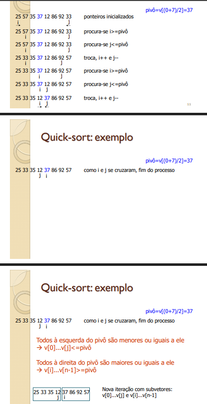

## QUICK SORT

*Escolha do pivo(x)*

*Ordenar o vetor em dois vetores, um com elementos menores que x, e outro com elementos maiores que x*
*Percorre o vetor da esquerda para a direita até v[i] >= x, e da direita para a esquerda até v[j] <= x*

**Basicamente i é incrementado enquanto v[i] < x, e j é decrementado enquanto v[j] > x**
**i vai primeiro, depois j**
**Se i<=j, troca v[i] com v[j] e i++, j--**
**Caso contrario, chama a recursão para [inicio......j] e [i.....fim]**

*Quando i/j se cruzam, a iteração finaliza, com v[0].....v[i] são <= que x*
*v[i]....v[n-1] >= x*

**SABER MELHOR E PIOR CASO**

## Escolha do pivô

*Boa abordagem: Escolher 3 elementos quaisquer do vetor e usar a mediana deles como pivô*
*Alternativa: escolha aleatória do pivô*
**EVITAR AO MÁXIMO ESCOLHER O MENOR ELEMENTO**

## ODDS

**Caso a escolha do pivo sempre seja a pior possivel**
*T(n) = n + (n-1) + (n-2) + (n-3) + ........*
*= n(1+n)/2 = O(n²)*

**Caso Médio**
*O( nlog(n) )*

## EXEMPLO

 **Exemplo Slide**

pivo = 2
[2, 1, 7, 3, 9, 5]
 i  j

[1, 2, 7, 3, 9, 5]
 j  i

pivo = 3
[1] [2, 7, 3, 9, 5] 
        i  j

